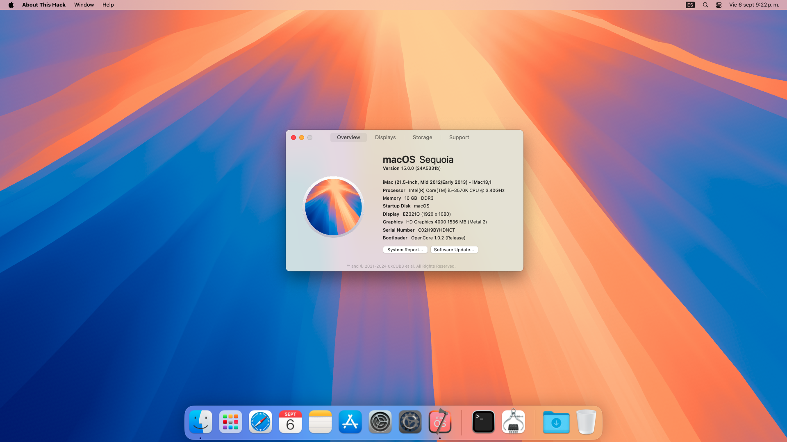
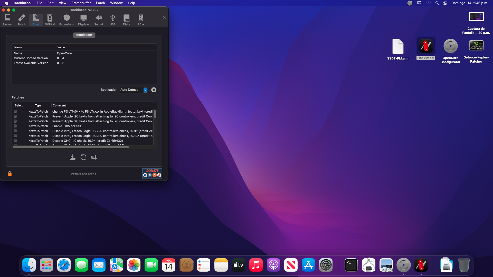

# Bienvenido al repositorio oficial de ReinierTutoriales Compatible con macOS 11 Big Sur, macOS 12 Monterrey, macOS 13 Ventura, macOS 14 Sonoma y macOS 15 Sequoia

# Apóyame con una donación 
Mediante [👉PayPal💵](https://www.paypal.com/paypalme/ReinierTutoriales?country.x=US&locale.x=es_XC)

# **Qué contiene este repositorio  👇**
Este repositorio contiene el directorio EFI para el combo Intel Intel® Core™ i5-3570K  y MotherBoard ASUS Z77 P8Z77V LX.

## Especificaciones

| Especificaciones     | Detalles                                  |
| ------------------- | -------------------------------------------|
| Motherboard         |  `ASUS-Z77-P8Z77V-LX`                      |
| Procesador          | Intel Core intel `i5 3570k`                |
| Memoria RAM         | `16GB`/`4GB` DDR3 1600MHz                  |
| Disco Duro          | SSD  `Crucial MX500` `240GB`               |
| Gráficos Integrados | Intel  `HD 4000`                           |
| Audio               | Realtek `ALC255`                           |
| Red-Ethernet        | Realtek `RTL8111`                          |

- **MotherBoard**: ASUS Z77 P8Z77V LX [👉Compr Aquí💵](https://s.click.aliexpress.com/e/_DEav2bR)
- **Procesador**: Intel Core i5-3570K [👉Compr Aquí💵](https://s.click.aliexpress.com/e/_DezOy29) 
- **RAM**: 2x8GB Fury Hyperx Viper III DDR3 1866MHz [👉Compr Aquí💵](https://s.click.aliexpress.com/e/_Ddspq81)
- **BT / WIFI**: Fenvi T919 (BCM94360CD) [👉Compr Aquí💵](https://amzn.to/3w3fkBX)

# Recomendación
- Te recomiendo que uses esto solo como un recurso de referencia.
- Este EFI contiene kexts adicionales en config.plist en lugar de solo las cosas esenciales para la ASUS Z77 P8Z77V LX. Debe eliminarlos antes de usar esto en su PC.

# Verifique esto antes de usar
En el archivo config.plist , genere códigos de serie nuevos ya que este carece de ellos, pues son personales y cada Mac necesita los de ella propios. Para generar la clave de serie, consulte la Guía OpenCore de Dortania . Cuando genere uno, debe seleccionar MacPro7,1 para un correcto funcionamiento.

# OpenCore
**Versión**: 1.0.0

# Estructura EFI
## ACPI
- SSDT-EC-DESKTOP.aml
- SSDT-IMEI.aml
- SSDT-PM.aml
## Drivers
- HfsPlus.efi
- OpenCanopy.efi
- OpenRuntime.efi
- ResetNvramEntry.efi
- ToggleSipEntry.efi
## Kexts
- AppleALC.kext
- CryptexFixup.kext
- Lilu.kext
- RealtekRTL8111.kext
- RestrictEvents.kext
- SMCProcessor.kext
- SMCSuperIO.kext
- USBInjectAll.kext
- VirtualSMC.kext
- WhateverGreen.kext
## Tools
- OpenShell.efi
- ResetSystem.efi

# Que Finciona
- Casi todo, incluida las actualizaciones de Apple (Handoff, iMessage, Airdrop, Facetime)
 
# Referencias
- [OpenCore Install Guide](https://dortania.github.io/OpenCore-Install-Guide/ "Dortania's OpenCore Install Guide")
- [Blog ReinierTutoriales](https://www.reiniertutoriales.com)
😎
